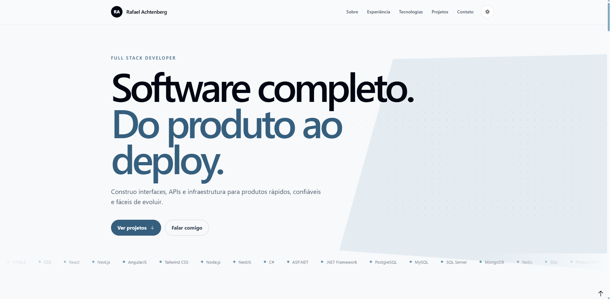
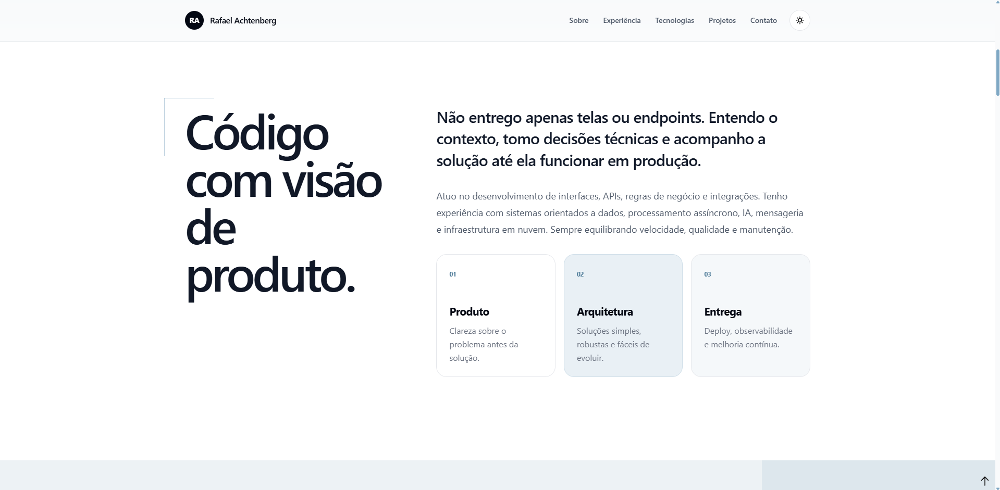
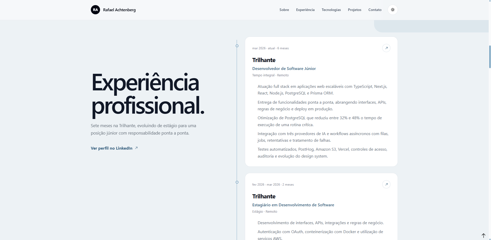
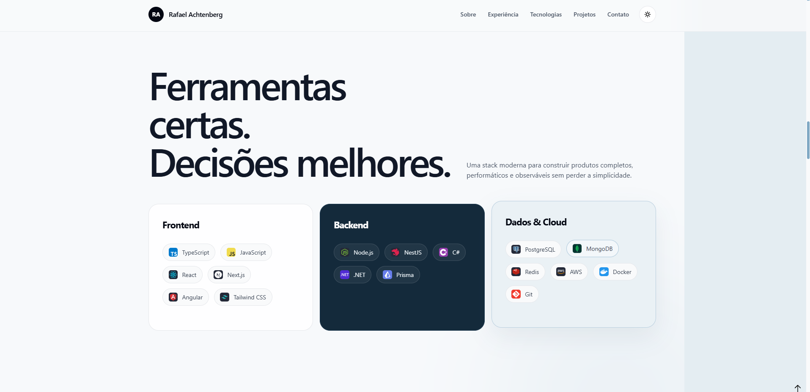
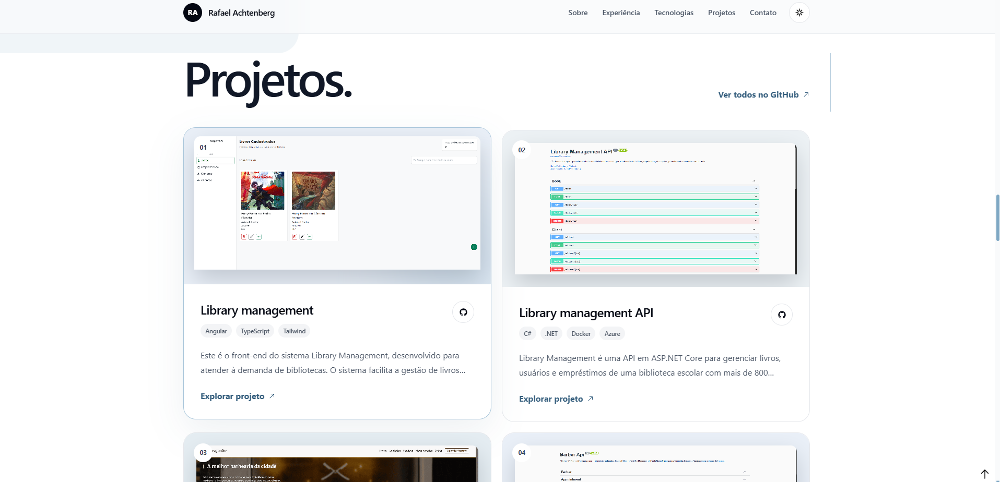
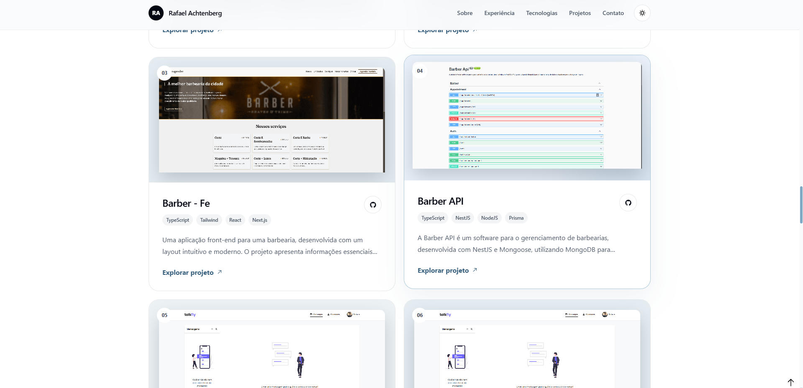
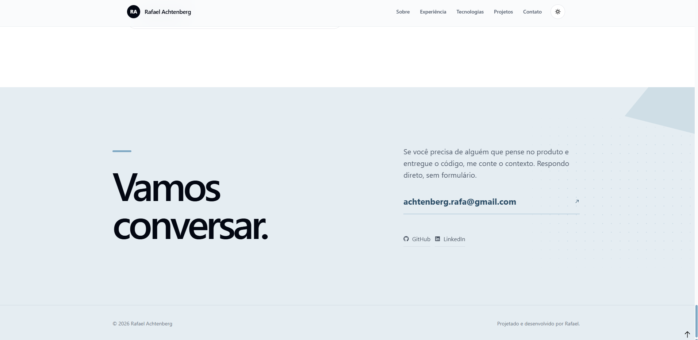

## 📖 Meu-portfolio

Portfólio profissional desenvolvido com foco em performance, componentização e experiência do usuário (UX).
A aplicação apresenta meus projetos, habilidades técnicas e trajetória como desenvolvedor Frontend, utilizando tecnologias modernas do ecossistema React.

O objetivo deste projeto é demonstrar boas práticas de arquitetura, organização de código e desenvolvimento escalável.

## 🎨 Tecnologias Utilizadas

- [React 19](https://react.dev/)
- [Vite](https://vitejs.dev/)
- [TypeScript](https://www.typescriptlang.org/)
- [TailwindCSS](https://tailwindcss.com/)
- [Zustand](https://zustand-demo.pmnd.rs/)
- [Radix UI](https://www.radix-ui.com/)


## 📸 Prévia da Interface

Abaixo algumas prévias principais da aplicação:


### Tela de Apresentação



### Tela de Sobre



### Tela de Experiência



### Tela de Habilidades



### Tela de Projetos





### Tela de Contato



## 🚀 Como Rodar o Projeto

1.  **Clone o Repositório:**

    ```bash
    git clone https://github.com/Faelkk/meu-portfolio
    ```

2.  **Instalar as Dependências**

    ```bash
    npm install
    ```

3.  **Rodar o Projeto**

    ```bash
    npm run start
    ```

🤝 **Como Contribuir?**

- ⭐ Deixe uma estrela no repositório.
- 🔗 Me siga aqui no GitHub.
- 👥 Conecte-se comigo no LinkedIn e faça parte da minha rede profissional.

👨‍💻**Autor**
Desenvolvido por [Rafael Achtenberg](linkedin.com/in/rafael-achtenberg-7a4b12284/).
